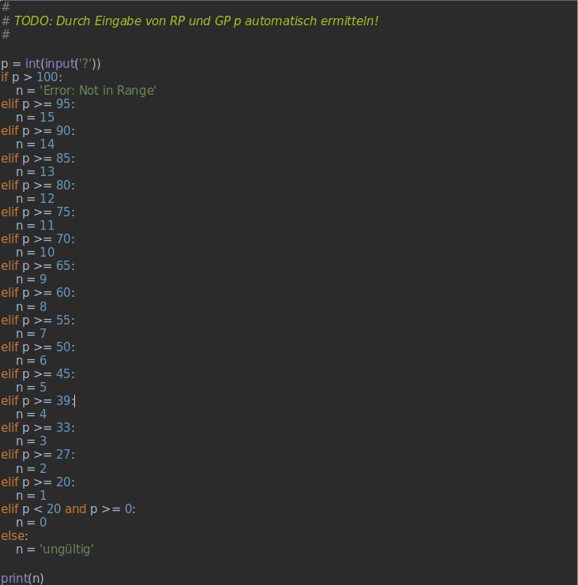

# Projekt 1.6: Bedingungen

Lehrer Lämpel hat folgendes Programm geschrieben, um sich sein Leben einfacher zu machen:

-------------------

Den Quellcode zum Programm finden Sie auch in unserem git repository: 

https://github.com/Oberschule-an-der-Egge/python-grundlagen-01.03-Bedingungen

Beantworten Sie die **fett** gedruckten Fragen schriftlich:

* Was tut das Programm?

* **Welchen Befehl musste L. verwenden, damit das Programm so funktioniert, wie er es sich vorstellt?**

* **Wie muss dieser Befehl aufgabaut sein?**

* Welche Vergleichsoperationen werden vorgenommen, wie werden diese im Quellcode dargestellt?

* Warum musste L. in der vorletzen Bedingung die logische Verknüpfung `and` verwenden?

* **Was bewirken die Rauten am Anfang des Quellcodes?**

* An was wollte sich L. mit TODO erinnern?

-------------------

## Hausaufgabe: 
Schreiben Sie das Programm so um,
 * dass nur noch Variablennamen verwendet werden, die für Außenstehende nachvollziehbar sind
 * dass L. nur noch RP und GP eingeben muss, um n zu erhalten
 * Sorgen Sie für den Fall vor, dass L. RP und GP bei seiner Eingabe vertauscht, indem Sie eine Fehlermeldung einbauen.

Quelle
------
Diese Übungsaufgabe wurde von C. Driebe (Github: DerTopher) entworfen.
